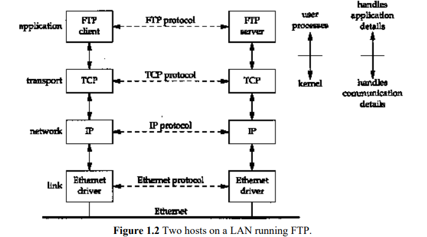
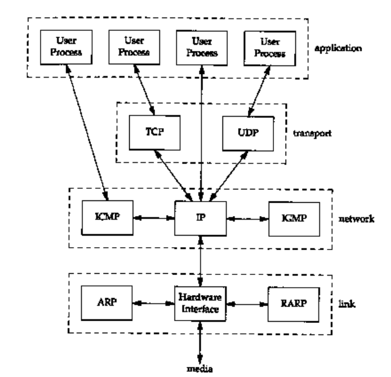
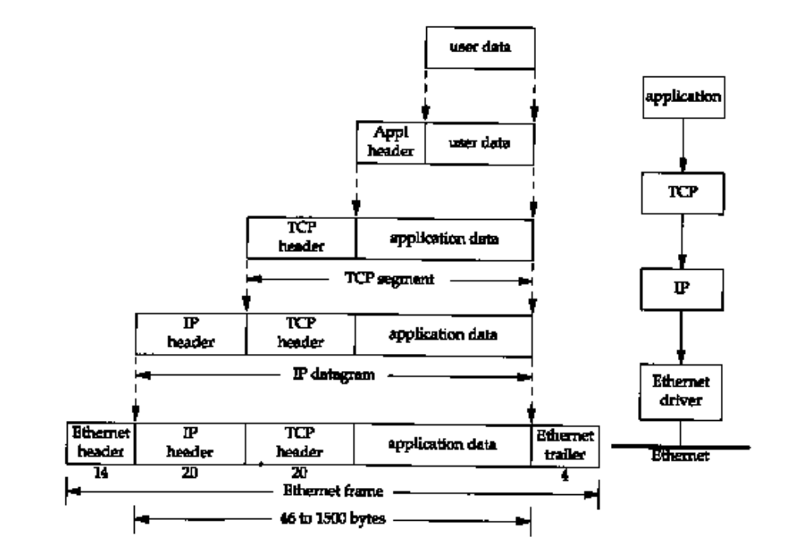
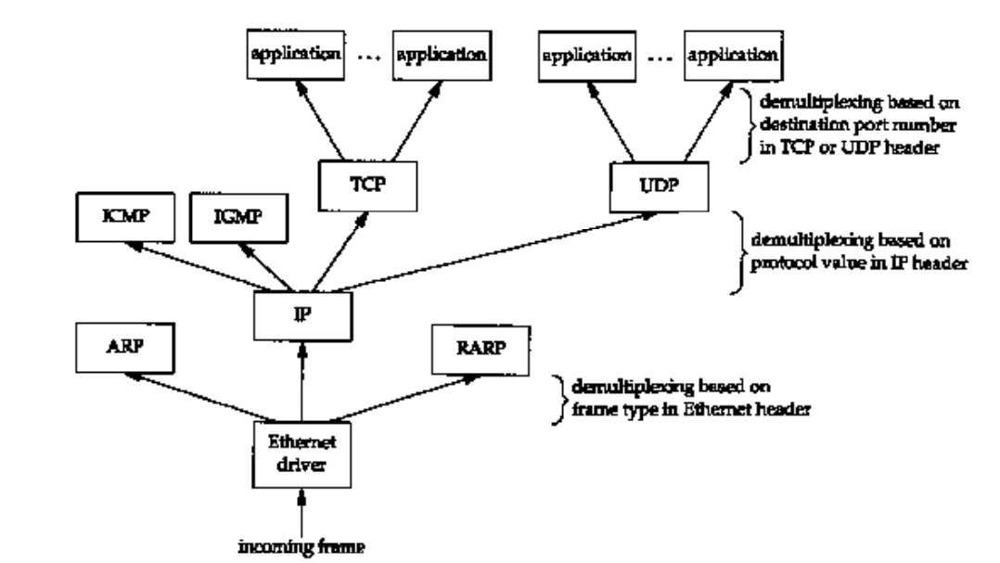

# Introduction

when we talk about how the hosts communicate with one another, TCP/IP suites can not be ignored. and we have a easy but representative plot to represent what we will focus.

## Layering

In this book, we will devide them into four layers, **Application, Transport, Network, Link**, every layer has its own functions:

- The link layer, sometimes called the **data-link** layer or **network interface** layer,Together they handle all the hardware details of physically  interfacing with the cable (or whatever type of media is being used).  

- The **network** layer (sometimes called the **internet** layer) handles the movement of packets  around the network. 

- The **transport** layer provides a flow of data between two hosts, for the application layer above. 

- The **application** layer handles the details of the particular application.

Each layer has one or more protocols for communicating with its **peers** at the same layer.

**multihomed**

- Any system with multiple interfaces 

One of the goals of an internet is to hide all the details of the physical layout of the internet from  the applications.  

## TCP/IP Layering

- TCP and UDP are the two predominant transport layer protocols. Both use IP as the network  layer. 
- TCP provides a reliable transport layer, even though the service it uses (IP) is unreliable. 
- UDP sends and receives datagrams for applications 

## Internet addresses

| classes | Range                         |
| ------- | ----------------------------- |
| **A**   | $0.0.0.0 - 127.255.255.255$   |
| **B**   | $128.0.0.0 - 191.255.255.255$ |
| **C**   | $192.0.0.0 - 223.255.255.255$ |
| **D**   | $224.0.0.0 - 239.255.255.255$ |
| **E**   | $240.0.0.0 - 255.255.255.255$ |

there are three types of IP address:

- unicast(destined for the single host)
- broadcast(destined for all hosts on a given network)
- multicast(destined for a set of hosts that belong to a multicast group)

## The Domain Name system

In the TCP/IP world the Domain Name  System (DNS) is a distributed database that provides the mapping between IP addresses and  hostnames. 

## Encapsulation

- The unit of data that TCP sends to IP is called a TCP  segment. 
- The unit of data that IP sends to the network interface is called an IP datagram. 
- The  stream of bits that flows across the Ethernet is called a frame.
- A physical property of an Ethernet frame is that the size of its data must be between 46 and 1500  bytes.  

- IP handles this by storing an 8-bit value in its header called the protocol field. A value  of 1 is for ICMP, 2 is for IGMP, 6 indicates TCP, and 17 is for UDP. 
- TCP and UDP use 16-bit port numbers to identify applications. TCP and UDP store the source  port number and the destination port number in their respective headers. 

## Demultiplexing

- using  the destination port number, the source IP address, and the source port number

