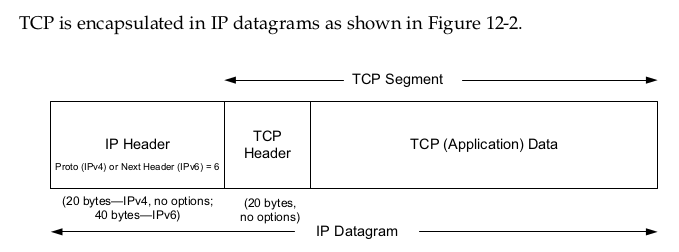
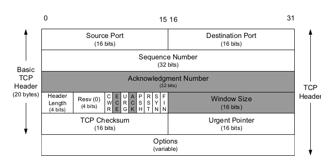

# TCP / Transmission Control Protocol 

**TCP provides a connection-oriented,reliable,byte stream service.**

- connection-oriented: 

  two applications using TCP must establish a TCP connection with one another before they can exchange the data.

- reliable

  - the application data is broken into what TCP considers that the best sized chunks to send. the unit of information passed by the TCP to IP  is called **segment**.
  - when TCP sends a segment it maintains a timer, waiting for the other end to acknowledge reception of the segment. if an acknowledgement isn't received in time, the segment is retransmitted.
  - when TCP receives data from the other end of the connection, it sends an acknowledgement
  - TCP maintains a checksum on its header and data, this is an end-to-end checksum whose purpose is to detect any modification of the data in transit.
  - A receiving TCP re-sequences the data if necessary,  passing the received data in the correct order to the application.
  - since IP datagrams can get duplicated, a receiving TCP must discard duplicate data.
  - TCP also provides flow control.

#### TCP Header

- CWR—Congestion Window Reduced (the sender reduced its sending rate);
- ECE—ECN Echo (the sender received an earlier congestion notification);
3. URG—Urgent (the Urgent Pointer field is valid—rarely used); 
- ACK—Acknowledgment (the Acknowledgment Number field is valid—always on after a connection is established); 
- PSH—Push (the receiver should pass this data to the application as soon as possible—not reliably implemented or used); 
- RST—Reset the connection (connection abort, usually because of an error);
- SYN—Synchronize sequence numbers to initiate a connection;
- FIN—The sender of the segment is finished sending data to its peer; 

The TCP Checksum field covers **the TCP header and data** and some fields in the IP header.

This is just a summary,and we'll make it more clear in the next parts.

