# TCP connection Control

## connection and termination

**it takes three segments to establish a connection, it takes four to terminate one.**

These three segments complete the connection establishment. This is often called the **three-way** handshake.

1. The active opener (normally called the client) sends a SYN segment (a TCP/IP packet with the SYN bit field turned on in the TCP header) specifying the port number of the peer to which it wants to connect and the client’s initial sequence number or ISN(c) . It typically sends one or more options at this point (see Section 13.3). This is segment 1.
2. The server responds with its own SYN segment containing its initial sequence number (ISN(s)). This is segment 2. The server also acknowledges the client’s SYN by ACKing ISN(c) plus 1. A SYN consumes one sequence number and is retransmitted if lost.
3. The client must acknowledge this SYN from the server by ACKing ISN(s) plus 1. This is segment 3.

The side that sends the first SYN is said to perform an **active open**. As mentioned, this is typically a client. The other side, which receives this SYN and sends the next SYN, performs a **passive open.** It is most commonly called the server.

and it need another tree segments to finish the close, it is made by the system call ( close() ).

1. The active closer sends a FIN segment specifying the current sequence number the receiver expects to see (K in Figure). The FIN also includes an ACK for the last data sent in the other direction (labeled L in Figure).
2. The passive closer responds by ACKing value K + 1 to indicate its successful receipt of the active closer’s FIN. At this point, the application is notified that the other end of its connection has performed a close. Typically this results in the application initiating its own close operation. The passive loser then effectively becomes another active closer and sends its own FIN. The sequence number is equal to L.
3. To complete the close, the final segment contains an ACK for the last FIN. Note that if a FIN is lost, it is retransmitted until an ACK for it is received.

### half-close

you can use the function `shutdown()` instead of `close()` to generate the status named half-close. In this case, the client has finished the requests for the data, but it wanna receive data from the remote server.

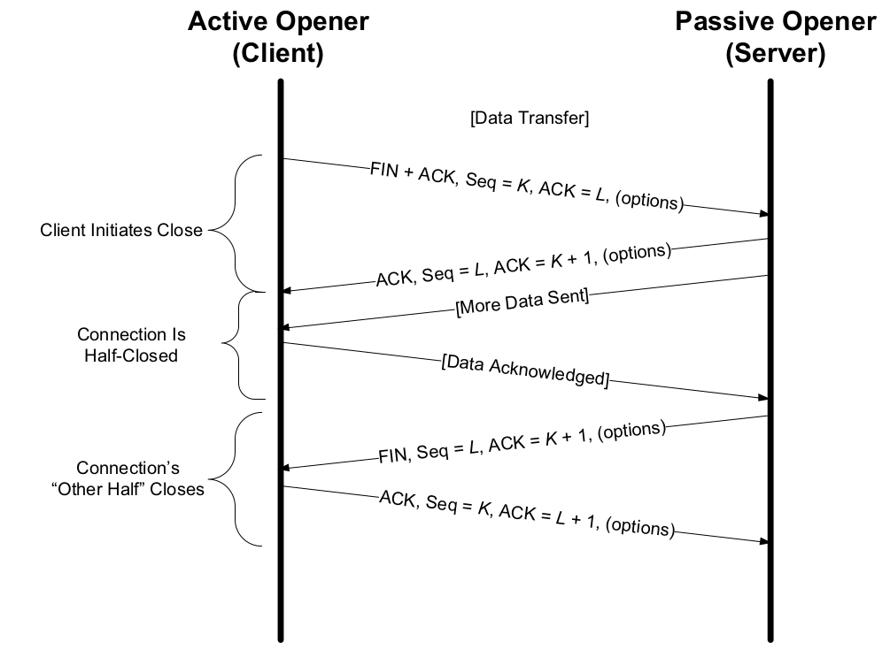

### simultaneous Open and close

as we discuss above, it happens rarely unless specifically arranged, for two applications to perform an active open to each other at the same time. Each end must have transmitted a SYN before receiving a SYN from the other side; the SYNs must pass each other on the network. This scenario also requires each end to have an IP address and port number that are known to the other end, which is rare. If this happens, it is called a **simultaneous open.**

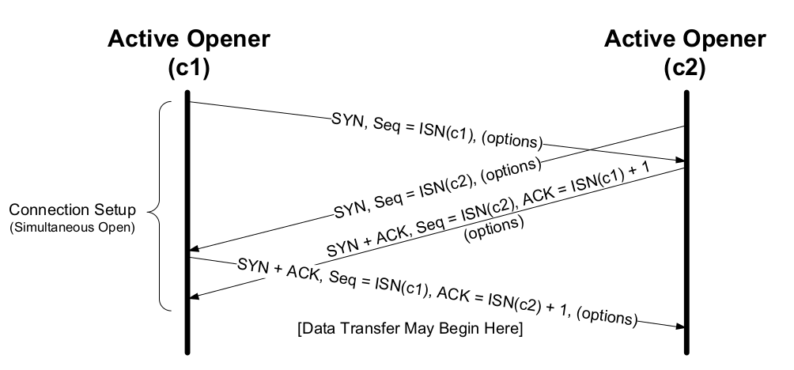

we do not call either end a client or a server, because both ends act as client and server.A simultaneous close is not very different. We said earlier that one side (often, but not always, the client) performs the active close, causing the first FIN to be sent. In a simultaneous close, both do.

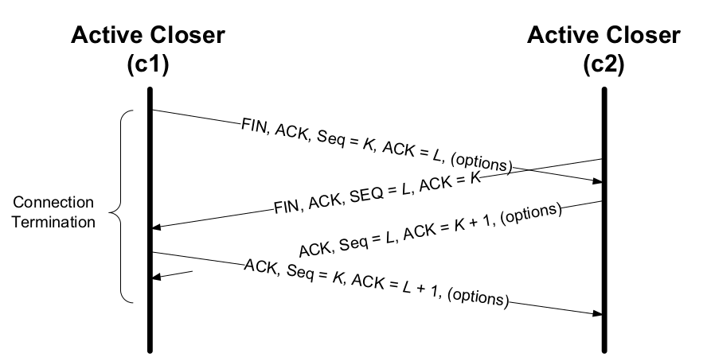

**The only real difference is that the segment sequence is interleaved instead of sequential.**

### initial sequence number (ISN)

The purpose of doing this is to arrange for the sequence numbers for segments on one connection to not overlap with sequence numbers on a another (new) identical connection.

In modern systems, the ISN is typically selected in a semirandom way. 

Linux goes through a fairly elaborate process to select its ISNs. It uses a clock-based scheme but starts the clock at a random offset for each connection. The random offset is chosen as a cryptographically hashed function on the connection identifier (4-tuple). A secret input to the hash function changes every 5 minutes. Of the 32 bits in the ISN, the top-most 8 bits are a sequence number of the secret, and the remaining bits are generated by the hash.
This produces an ISN that is difficult to guess, but also one that increases over time.

## TCP Options

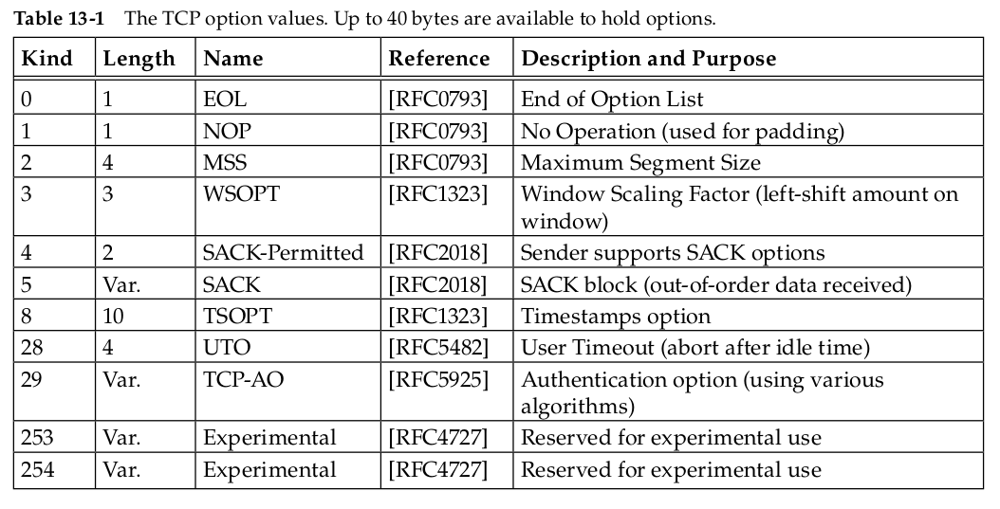

Every option begins with a 1-byte kind that specifies the type of option. The options with a kind value of 0 and 1 occupy a single byte. The other options have a **len** byte that follows the **kind** byte. **The length is the total length, including the kind and len bytes.**

### Maximum Segment Size(MSS) option

The maximum segment size (MSS) is the largest segment that a TCP is willing to receive from its peer and, consequently, the largest size its peer should ever use when sending. **The MSS value only counts the TCP data types.** 

The MSS values in Figure 13-5 are all 1460, which is typical for IPv4. The resulting IPv4 datagram is normally 40 bytes larger (1500 bytes total, the typical MTU size for Ethernet and path MTU for the Internet): 20 bytes for the TCP header and 20 bytes for the IPv4 header. When IPv6 is used, the MSS is usually 1440, 20 bytes less because of the larger IPv6 header.

### Selective Acknowledgment (SACK) Options 

If a TCP sender were able to learn of the existence of holes (and out-of- sequence data blocks beyond holes in the sequence space) at the receiver, it could better select which particular TCP segments to retransmit when segments are lost or otherwise missing at the receiver. The TCP selective acknowledgment (SACK) options provide this capability.

**SACK** information contained in a SACK option consists of a range of sequence numbers representing data blocks the receiver has successfully received. **Each range is called a SACK block and is represented by a pair of 32-bit sequence numbers.** Thus, a SACK option containing n SACK blocks is (8n + 2) bytes long. **Two bytes are used to hold the kind and length of the SACK option.**

Because of the limited amount of space available in the option space of a TCP header, the maximum number of SACK blocks available to be sent in a single segment is three.

### Window Scale (WSCALE or WSOPT) Option

The Window Scale option (denoted WSCALE or WSOPT) effectively increases the capacity of the TCP Window Advertisement field from 16 to about 30 bits.

This option can appear only in a SYN segment, so the scale factor is fixed in each direction when the connection is established.

### Timestamps Option and Protection against Wrapped Sequence Numbers (PAWS)

The Timestamps option lets the sender place two 4-byte timestamp values in every segment. The receiver reflects these values in the acknowledgment, allowing the sender to calculate an estimate of the connection’s RTT for each ACK received.

When using the Timestamps option, the sender places a 32-bit value in the Timestamp, Value field (called TSV or TSval) in the first part of the TSOPT, and the receiver echoes this back unchanged in the second Timestamp Echo Retry field (called TSER or TSecr). TCP headers containing this option increase by 10 bytes (8 bytes for the two timestamp values and 2 to indicate the option value and length).

although the Timestamps option allows for more frequent RTT samples, it also provides a way for the receiver to avoid receiving old segments and considering them as valid. This is called **Protection Against Wrapped Sequence Numbers (PAWS).**

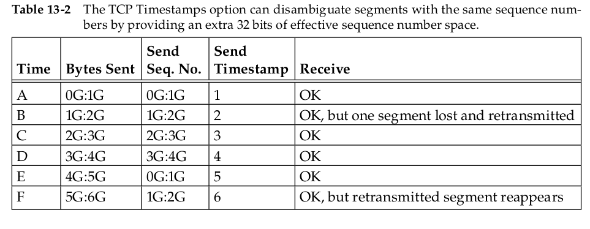

The receiver considers the timestamp as a 32-bit extension of the sequence number. Because the lost segment that reappears at time F has a time-
stamp of 2, which is less than the most recent valid timestamp (5 or 6), it is discarded by the PAWS algorithm.

The PAWS algorithm does not require any form of time synchronization between the sender and the receiver. All the receiver needs
is for the timestamp values to be monotonically increasing, and to increase by at least 1 per window of data.

### User Timeout (UTO) Option

The UTO value (also called USER_TIMEOUT) specifies the amount of time a TCP sender is willing to wait for an ACK of outstanding data before concluding that the remote end has failed.

The way to set USER_TIMEOUT, then, is as follows:

`USER_TIMEOUT = min(U_LIMIT, max(ADV_UTO, REMOTE_UTO, L_LIMIT))`

where ADV_UTO is the UTO option advertised to the remote TCP, REMOTE_UTO is the peer’s advertised UTO option value, U_LIMIT is the local system’s upper UTO limit, and L_LIMIT is the local system’s UTO lower limit. Note that this formula does not guarantee that each end of the same connection will arrive at the same USER_TIMEOUT value.

**UTO options are included on SYN segments when a connection is established, on the first non-SYN segments, and whenever the USER_TIMEOUT value is changed.**

The option value is expressed as a 15-bit value in units of seconds or minutes following a bit field (“granularity”) that indicates that the value is in minutes (1) or seconds (0).

### Authentication Option (TCP-AO)

There is an option used to enhance the security of TCP connections. It is designed to enhance and replace an earlier mechanism called TCP-MD5. Called the **TCP Authentication Option (TCP-AO)** , it uses a cryptographic hash algorithm, in combination with a secret value known to each end of a TCP connection, to authenticate each segment.

## TCP state transitions

The current state is changed based on various stimuli, such as segments that are transmitted or received, timers that expire, application reads or writes, or information from other layers. These rules can be summarized in TCP’s state transition diagram.

### TCP state Transition Diagram

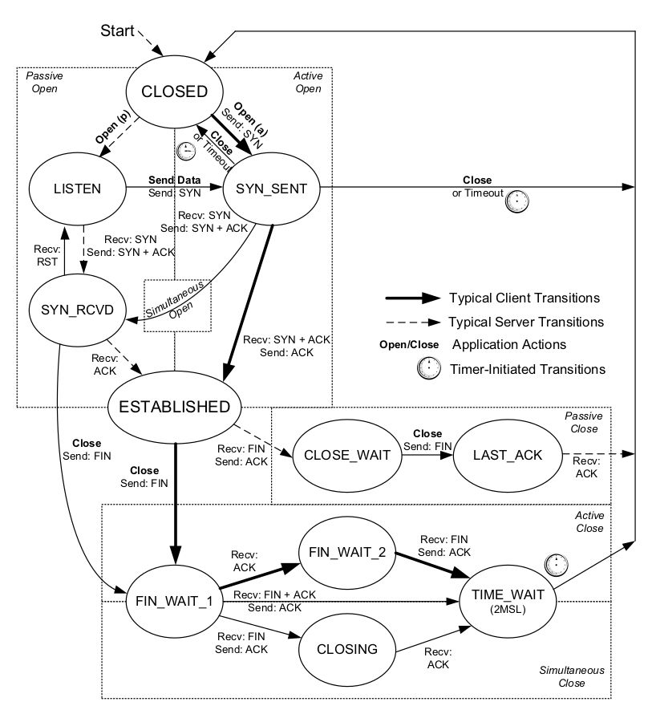

### TIME_WAIT (2MSL Wait) State

The TIME_WAIT state is also called the 2MSL wait state. It is a state in which TCP waits for a time equal to twice the Maximum Segment Lifetime (MSL), sometimes called **timed wait.** it is the maximum amount of time any segment can exist in the network before being discarded.

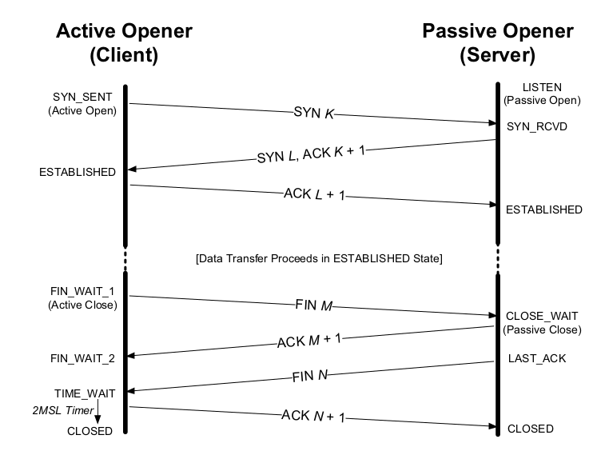

**Common implementation values, however, are 30s, 1 minute, or 2 minutes.**

The reasons for the 2MSL Timer:

- because the other side will retransmit its FIN (which does consume a sequence number). Indeed, TCP will always retransmit FINs until it receives a final ACK.
- while the TCP implementation waits, the endpoints defining that connection (client IP address, client port number, server IP address, and server port number) cannot be reused. That connection can be reused only when the 2MSL wait is over, or when a new connection uses
  an ISN that exceeds the highest sequence number used on the previous instantiation of the connection, or if the use of the Timestamps option allows the disambiguation of segments from a previous connection instantiation to not otherwise be confused.

The 2MSL wait provides protection against delayed segments from an earlier instantiation of a connection being interpreted as part of a new connection that uses the same local and foreign IP addresses and port numbers.

### Quiet Time Concept

To protect against this case that if a host with connections in the TIME_WAIT state crashes, reboots within the MSL, and immediately establishes new connections using the same local and foreign IP addresses and port numbers corresponding to the local connections that were in the TIME_WAIT state before the crash, delayed segments from the connections that existed before the crash can be misinterpreted as belonging to the new connections created after the reboot.

TCP should wait an amount of time equal to the MSL before creating any new connections after a
reboot or crash. This is called **the quiet time.** 

### FIN_WAIT_2 State

In the FIN_WAIT_2 state, TCP has sent a FIN and the other end has acknowledged it. Unless a half-close is being performed, the TCP must wait for the application on the other end to recognize that it has received an end-of-file notification and close its end of the connection, which causes a FIN to be sent. Only when the application performs this close (and its FIN is received) does the active closing TCP move from the FIN_WAIT_2 to the TIME_WAIT state. This means that one end of the connection can remain in this state forever.The other end is still in the CLOSE_WAIT state and can remain there forever, until the application decides to issue its close.

### Simultaneous Open and Close Transitions

We have seen the normal uses for the SYN_SENT and SYN_RCVD states that correspond to sending and receiving SYN segments, respectively. As illustrated in Figure 13-3, TCP was purposely designed to handle simultaneous opens that result in a single connection. When a simultaneous open occurs, the state transitions differ from those shown in Figure 13-9. Both ends send a SYN at about the same time, entering the SYN_SENT state. When each end receives its peer’s SYN segments, the state changes to SYN_RCVD, and each end resends a SYN and acknowledges the received SYN. When each end receives the SYN plus the ACK, the state changes to ESTABLISHED.
For a simultaneous close, in terms of Figure 13-6, both ends go from ESTABLISHED to FIN_WAIT_1 when the application issues the close. This causes both FINs to be sent, and they probably pass each other somewhere in the network. When its peer’s FIN arrives, each end transitions from FIN_WAIT_1 to the CLOSING state, and each endpoint sends its final ACK. Upon receiving a final ACK, each endpoint’s state changes to TIME_WAIT, and the 2MSL wait is initiated.

## TCP reset Segment

A segment having RST bit set to “on” is called a “reset segment” or simply a “reset.” In general, a reset is sent by TCP whenever a segment arrives that does not appear to be correct for the referenced connection. Resets ordinarily result in a fast tear down of a TCP connection

### Connection Request to Nonexistent Port

A common case for generating a reset segment is when a connection request arrives and no process is listening on the destination port.

**the sequence number of the reset is set to 0 and the ACK number is set to the incoming ISN plus the number of data bytes in the segment.**

### Aborting a Connection

it is also possible to abort a connection by sending a reset instead of a FIN at any time. This is sometimes called an **abortive release.**

Aborting a connection provides two features to the application: 

1. any queued data is thrown away and a reset segment is sent immediately
2. the receiver of the reset can tell that the other end did an abort instead of a normal close. The API being used by the application must provide a way to generate the abort instead of a normal close.

### Half-Open Connections

A TCP connection is said to be **half-open** if one end has closed or aborted the connection without the knowledge of the other end. This can happen anytime one of the peers crashes. As long as there is no attempt to transfer data across a half-open connection, the end that is still up does not detect that the other end has crashed.

Another common cause of a half-open connection is when one host is powered off instead of shut down properly.

### TIME-WAIT Assassination (TWA)

the TIME_WAIT state is intended to allow any datagrams lingering from a closed connection to be discarded. During this period, the waiting TCP usually has little to do; it merely holds the state until the 2MSL timer expires. If, however, it receives certain segments from the connection during this
period, or more specifically an RST segment, it can become desynchronized. This is called **TIME-WAIT Assassination.**

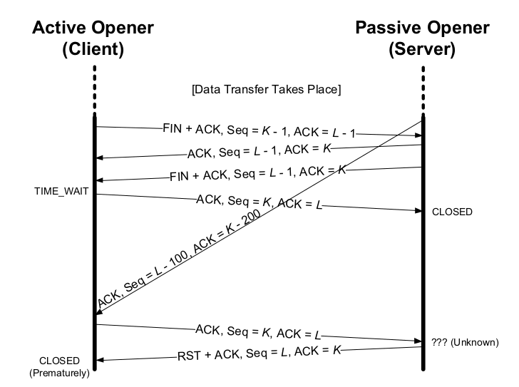

This is no problem for the server, but it causes the client to prematurely transition from TIME_WAIT to CLOSED. Most systems avoid this problem by simply not reacting to reset segments while in the **TIME_WAIT** state.

## TCP Server Operation

we wish to become familiar with how TCP servers use port numbers and how multiple concurrent clients are handled.

### TCP Port Numbers 

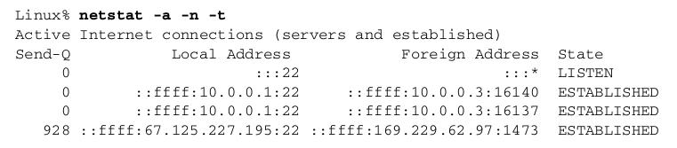

The local address (which really means local endpoint) is output as `:::22`,  which is the IPv6-oriented way of referring to the all-zeros address, also called
the wildcard address, along with port number 22. This means that an incoming connection request (i.e., a SYN) to port 22 will be accepted on any local interface.

The foreign address is output as `:::*`, which means both a wildcard address and port number.

### Restricting Local IP Addresses

We can see what happens when the server does not wildcard the local IP address but instead sets it to one particular local address.

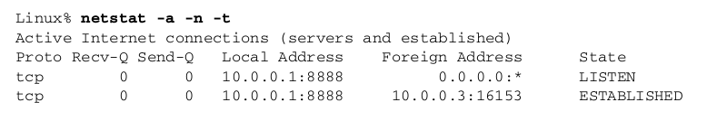

If we instead try to connect to this server from a host using a destination address other than 10.0.0.1 (even including the local address 127.0.0.1), the connection request is not accepted by the TCP module. If we watch with tcpdump, the SYN elicits an RST segment.

### Restricting Foreign Endpoints

The abstract interface functions for TCP  allow a  server doing a passive open to have either a fully specified foreign endpoint (to wait for a particular client to issue an active open) or an unspecified foreign end-point (to wait for any client). 

Table 13-3 summarizes the three types of address bindings that a TCP server can establish.

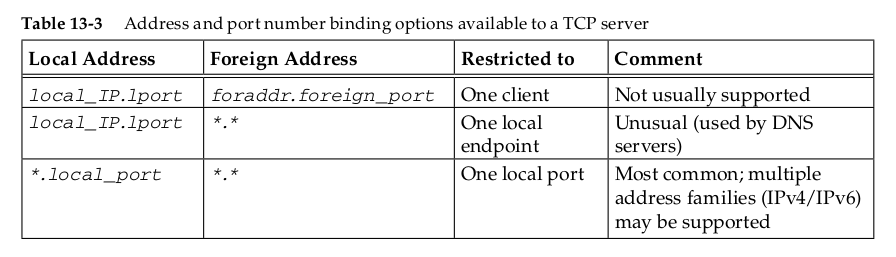

In all cases, local_port is the server’s assigned port and local_IP must be a unicast IP address used by the local system. The ordering of the three rows
in the table is the order that the TCP module applies when trying to determine which local endpoint receives an incoming connection request. The most specific binding (the first row, if supported) is tried first, and the least specific (the last row with both IP addresses wildcarded ) is tried last.

### Incoming Connection Queue

The application can therefore limit the number of fully formed connections waiting for it to handle. In Linux, then, the following rules apply:

1. When a connection request arrives (i.e., the SYN segment), the system-wide parameter `net.ipv4.tcp_max_syn_backlog` is checked (default 1000). If the number of connections in the `SYN_RCVD` state would exceed this threshold, the incoming connection is rejected.

2. Each listening endpoint has a fixed-length queue of connections that have been completely accepted by TCP (i.e., the three-way handshake is complete) but not yet accepted by the application. The application specifies a limit to this queue, commonly called the **backlog**. This backlog must be between 0 and a system-specific maximum called `net.core.somaxconn`, inclusive (default 128). Keep in mind that this backlog value specifies only the maximum number of queued connections for one listening endpoint, all of which have already been accepted by TCP and are waiting to be accepted by the application.This backlog has no effect whatsoever on the maximum number of established connections allowed by the system, or on the number of clients that a concurrent server can handle concurrently.
3. If there is room on this listening endpoint’s queue for this new connection, the TCP module ACKs the SYN and completes the connection. The server
  application with the listening endpoint does not see this new connection until the third segment of the three-way handshake is received. Also, the
  client may think the server is ready to receive data when the client’s active open completes successfully, before the server application has been notified of the new connection. If this happens, the server’s TCP just queues the incoming data.
4. If there is not enough room on the queue for the new connection, the TCP delays responding to the SYN, to give the application a chance to catch up. Linux is somewhat unique in this behavior—it persists in not ignoring incoming connections if it possibly can. If the `net.ipv4.tcp_abort_on_overflow` system control variable is set, new incoming connections are reset with a reset segment.

